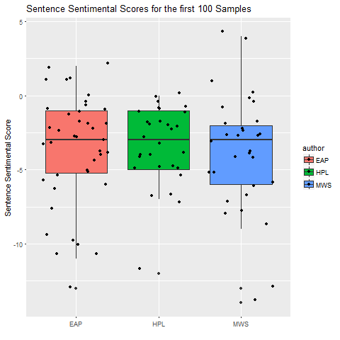
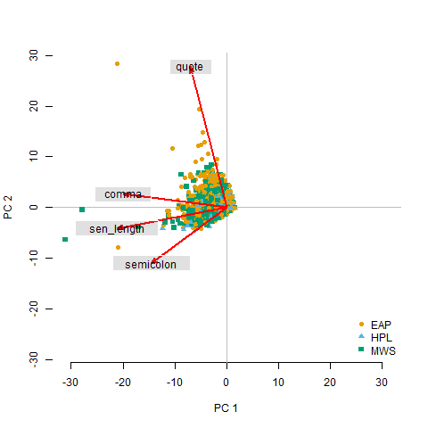
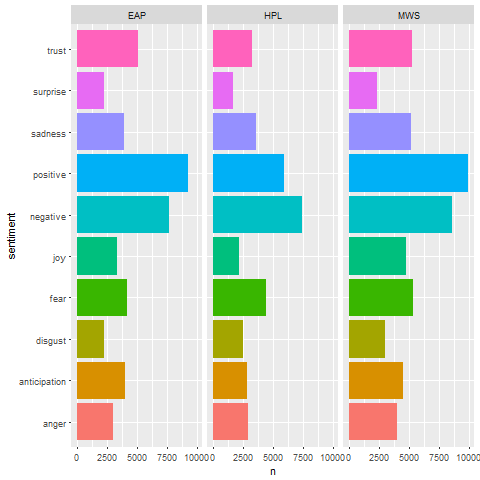

# Project 1: What did the spooky text tell us about authors?
## Kai Li

----

## Project Description
Term: Spring 2018

### Project and Data Description
This project is about the Natural Language Processing (NLP). The dataset comes from Kaggle Spooky Author Identification. In this project, besides reproduction of the tutorial, new findings:
Section 1
Use streaming method to process data
Comparing streaming and non-steaming differences in top frequency words in both world cloud and top frequency used for each author
Section 2
Explore punctuation mark feature such as comma and semicolon as features
Convert those features into numerical features
Classification by using Principal Component Analysis (PCA) method 
Section 3
Sentimental analysis in sentence level
Comparing results of sentimental analysis in both words and sentence level

The data set is a 19579 x 3 matrix. There are three columns: “id”, “text” and “author”, and 19579 rows of text from three popular horror authors: Edgar Allan Poe (EAP), HP Lovecraft (HPL), and Mary Wollstonecraft Shelley (MWS).

### Description of Authors

Edgar Allan Poe was an American writer, editor, and literary critic. Poe is best known for this poetry and short stories. His writing style was recognized as typical “Gothic” style which presented either death, lost love or both. 
Masterpiece: The Fall of the House of Usher, The Tell-Tale Heart, The Raven

Howard Philips Lovecraft: 
HP Lovecraft was an American author of fantasy, horror, and science fiction. His writing style was the “cosmism” or “cosmic horror”. It means life is incomprehensible to humankind and universe is inimical to the interest of humankind.
Masterpiece: The Complete Fiction of H. P. Lovecraft, The Call of Cthulhu, Great Tales of Horror

Mary Wollstonecraft Shelley:
Mary Wollstonecraft Shelly was an English author of a horror novel. Her most famous novel is Frankenstein or Modern Prometheus. Shelley was good at combining love and horror and shown the romantic features in her horror novel.
Masterpiece: Frankenstein, Modern Prometheus

## Section 1: Data cleaning and visualation
Read the data and process sentences to one word per row. 
Also, stream words by use the function
Try to split sentences into two or three words per row to explore some meaningful features.

### Tokenization & Streaming
Process text with tokenization and streaming process. Convert text into a matrix with single, two-words, or three-words per row. 

#### Wordcloud for single words with and without streaming

#### Wordcloud for streaming words

#### ompare differences between streaming and non-streaming words in top 50 frequently.

By comparing these tow words and the frequency table, it shows that the streaming works well. Streaming helps combine some words with same meaning. However, by observing the data set after streaming, there are some problems exist. For example, "happy" becomes "happi" after streaming. This would have a negative impact on some analysis especially the sentimental analysis.

#### Wordcloud for two-words per row

#### Wordcloud for three-words per row

The word cloud for two-words or three-words is not very meaningful. The high-frequency terms usually do not have any information. However, it can be improved by advanced algorithms or dictionary to recognize the phrase rather than split into every two words.

### Plot the most frequent streaming words used each author
.png)
.png)

It is a better visualization of words frequencies for differences with or without streaming.

## Section 2: Converting punctuation mark features to numerical features and Clustering
### Punctuation mark features

### Classification Based on features explored above

Explore feature of punctuation marks such as ",", ";" and "'". Try to do classification by using PCA methods. However, the plots show comma and semicolon are in the same direction with sentence length. and the quote is relatively less related to the other three.
It is reasonable. When the length of sentences becomes longer, it tends to have more comma or semicolon. Thus, it is hard to use the length of sentences, comma, semicolon to predict the author. However, at the quote direction, there are more yellow dots concentrated. It means EAP tends to use more quote than other two authors. In other words, EAP would have more dialogs than the other two authors.

## Section 3: Sentiment Analysis
### Sentimental Analysis in Word Level
Do not use the streamed data for the sentimental analysis, because some words are twisted. For example, after streaming happy would change to happi. Such change would not return correct results.

### Sentiment Analysis in Sentence Level

The sentimental analysis in sentence level:
It took lots of time to run the program, so pick a small set as the sample to run the sentimental analysis at the sentence level. By observing the box plot, it shows MWS has relatively lower scores than other two authors. Majority of dots are located below the 0 line. It means the majority of the three authors' sentences are considered as the negative attitude. It matches their writing style. Also, MWS have lower scores can be shown by the words sentimental analysis that MWS used more negative words. 

problem:
1. it is hard to determine such large set of sentences
2. Some worlds present different sentimental such lovely. Lovely can represent both positive and negative.
3. It is not accurate to determine levels of sentiment
