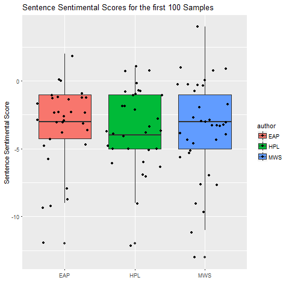

# Project 1: What did the spooky text tell us about authors?
## Kai Li

----

## Project Description
Term: Spring 2018

### Project and Data Description
The main method used for this project is Natural Language Processing (NLP). The dataset comes from Kaggle.com - Spooky Author Identification. In this project, here are some new findings:
+ Section 1
Add streaming method to tokenized data. It helps combine words with same meaning rather than two different words, such as "love" and "loved".
Comparing differences between streaming and non-steaming words at high frequency/. Plot both cases in world cloud and top frequency words used for each author.
+ Section 2
Explore punctuation mark features such as comma and semicolon.
Convert those features into numerical features
Classify text by using Principal Component Analysis (PCA) method 
+ Section 3
Sentimental analysis in sentence level
Comparing results of sentimental analysis in both words and sentence level

#### Data Description
The data set is a 19579 x 3 matrix. There are three columns: “id”, “text” and “author”, and 19579 rows of sentences from three popular horror authors: Edgar Allan Poe (EAP), HP Lovecraft (HPL), and Mary Wollstonecraft Shelley (MWS).

### Description of Authors
#### Edgar Allan Poe

Edgar Allan Poe was an American writer, editor, and literary critic. Poe is best known for his poetry and short stories. His writing style was recognized as typical “Gothic” style which presented either death, lost love or both. 
Masterpiece: The Fall of the House of Usher, The Tell-Tale Heart, The Raven

#### Howard Philips Lovecraft

HP Lovecraft was an American author of fantasy, horror, and science fiction. His writing style was the “cosmism” or “cosmic horror”. It means that life is incomprehensible to humankind and universe is inimical to the interest of humankind.
Masterpiece: The Complete Fiction of H. P. Lovecraft, The Call of Cthulhu, Great Tales of Horror

#### Mary Wollstonecraft Shelley

Mary Wollstonecraft Shelly was an English author of a horror novel. Her most famous novel is Frankenstein or Modern Prometheus. Shelley was good at combining love and horror and shown the romantic features in her horror novel.
Masterpiece: Frankenstein, Modern Prometheus

## Section 1: Data cleaning and visualation
Read the data and process sentences to one word per row. 
Also, stream words by use the function stem_words()
Try to split sentences into two or three words per row in order to explore some meaningful features.

#### Wordcloud for single words with and without streaming

#### Wordcloud for streaming words

#### ompare differences between streaming and non-streaming words in top 50 frequently.

By comparing these tow word clouds and the frequency table, it shows that the streaming actually works. Streaming helps combine some words with same meaning. However, by observing the data set after streaming, there are some problems exist. For example, "happy" becomes "happi" after streaming. This would result in negative impacts on some analysis especially the sentimental analysis. The "happi" would not match "happy" in the dictionary.

#### Wordcloud for two-words per row

#### Wordcloud for three-words per row

These word clouds of two-words or three-words are not very meaningful. The high-frequency terms usually do not contain any information. However, it can be improved by advanced algorithms or dictionaries which can recognize the phrase rather than just simply split sentences into chunks with two words.

### Plot the most frequent streaming words used each author
.png)
.png)

It is a better visualization of words frequencies of differences with or without streaming.
In summary, streaming works well considering the frequency of words. However, it not suitable for some other analysis. 

## Section 2: Converting punctuation mark features to numerical features and Clustering
### Punctuation mark features

### Classification Based on features explored above

Explore features of punctuation marks such as ",", ";" and "'" and try to do classification by using PCA methods. However, these plots show comma and semicolon are in the same direction with sentence length. At the meantime, the quote is relatively less related to the other three. It is reasonable. When the length of sentences becomes longer, it tends to have more commas or semicolons. Thus, it is hard to use the length of sentences, comma, semicolon to predict the author. However, at the quote direction, there are more yellow dots concentrated. It means Edgar Allan Poe (EAP) tends to use more quote than other two authors. In other words, Poe would have more dialogs than the other two authors.

## Section 3: Sentiment Analysis
### Sentimental Analysis in Word Level

### Sentiment Analysis in Sentence Level

Do not use the streamed data for the sentimental analysis, because some words are twisted. For example, after streaming happy would change to happi. Such change would not return correct results.

The sentimental analysis in sentence level:
It took lots of time to run the program, so I picked a small set as the sample to run the sentimental analysis at the sentence level. By observing the box plot, it shows Mary Wollstonecraft Shelly (MWS) has a relatively higher mean of scores than other two authors. Combined with the sentimental analysis in words level, it shows the Shelly use more positive words. It matches her writing style that combining romantic with horror together.
Majority of dots are located below the 0 line. It means three authors' majority of sentences are considered as the negative attitude. It matches their writing style. Also, MWS have lower scores can be shown by the words sentimental analysis that MWS used more negative words. 

problem:
1. It took very long time to process large data set.
2. Some worlds present different sentimental such as lovely in dictionary "nrc". Lovely can represent both positive and negative in "nrc".
3. It is not accurate to determine levels of sentiment. I only separate sentimental into two categories, but it could have more categories and each category has different scores.

### In Summary

Poe and Lovecraft are a little bit more negative than Shelly based on the sentimental analysis in both words and sentences level. They have a very similar writing style, such as words used in high frequency. However, Poe tends to use more words, quote and comma than Lovecraft. It shows that Poe tends to use more dialogue and his sentences have more varieties of length than the other two authors.
Compared with Poe, Lovecraft tends to use less comma, and semicolon.
Shelly tend to be more positive by using words like "love" from the high-frequency words sued for each author plot. However, the majority of her sentence still be negative. Therefore, the feature matches her writing style that combines romantic with horror together.
